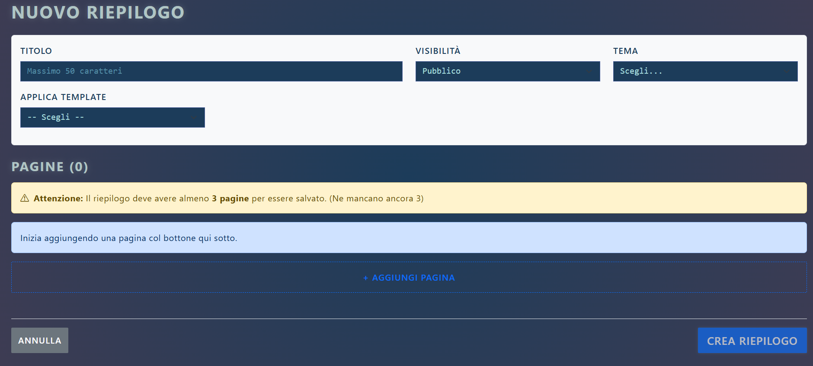
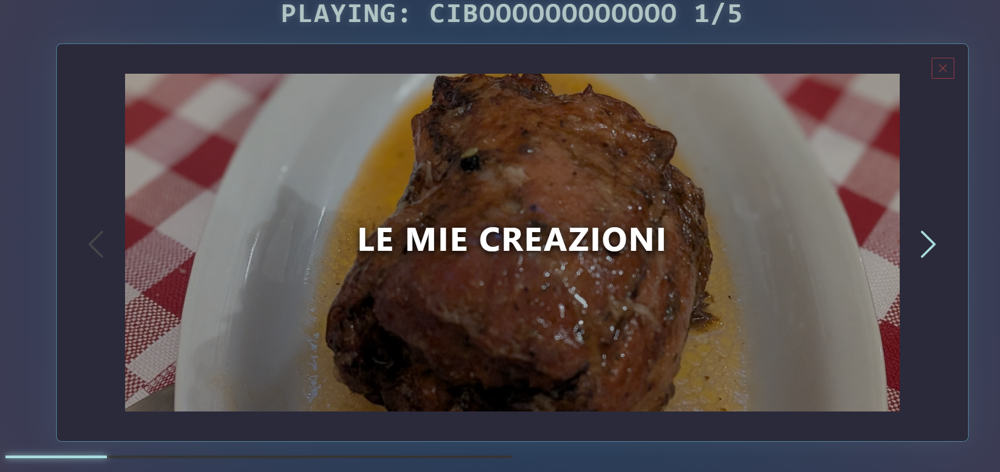

# 📊 Annual Summary Dashboard

A full-stack web application designed to track, manage, and visualize annual data summaries. Built with a modern JavaScript stack, focusing on a clear separation of concerns between the client interface and the REST API.

## 🚀 Key Features
* **Secure Authentication**: User registration and session management powered by Passport.js.
* **Interactive UI**: Dynamic, state-driven frontend built with React.
* **RESTful API**: Robust Node.js backend handling data validation, routing, and business logic.
* **Decoupled Architecture**: Clear client-server separation allowing independent development and testing.

## 🛠️ Tech Stack
* **Frontend**: React.js, [Bootstrap]
* **Backend**: Node.js, Express.js
* **Authentication**: Passport.js (JWT / Session-based)
* **Database**: [SQLite]

## 📸 Screenshots
> **Note:** *Visual context of the application interface.*


*Figure 1: Main dashboard displaying annual metrics.*


*Figure 2: Secure authentication flow.*

## 💻 Getting Started (Local Setup)

Follow these instructions to set up the project locally on your machine.

### Prerequisites
* [Node.js](https://nodejs.org/) (v14 or higher recommended)
* npm or yarn installed

### 1. Backend Setup
Navigate to the backend directory, install the dependencies, and start the server:
```bash
git clone [https://github.com/](https://github.com/)[Tuo-Username]/[nome-repo].git
cd [nome-repo]/backend

# Install dependencies
npm install

# Start the API server
npm start